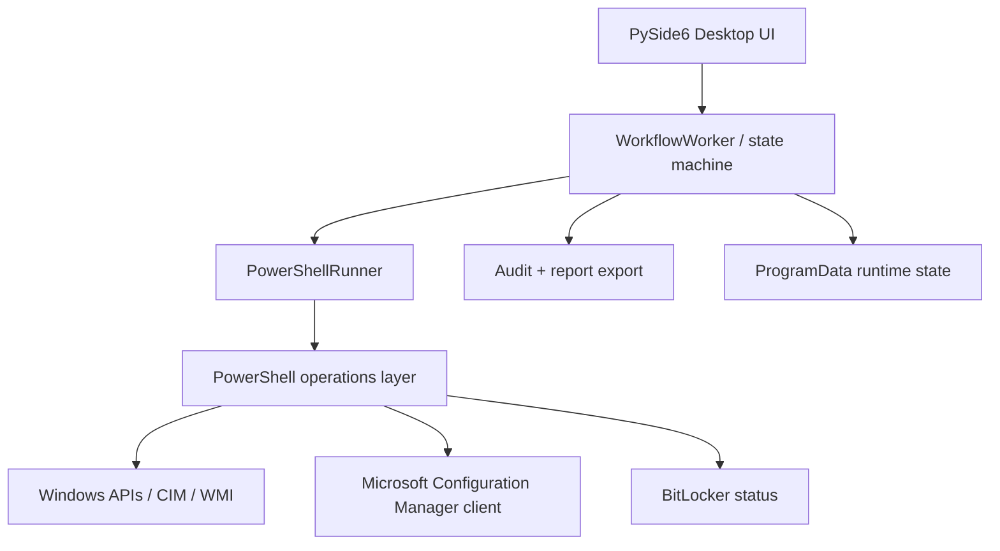

<p align="center">
  
</p>

<h1 align="center">BLADE</h1>
<p align="center"><strong>BitLocker Lifecycle Automation & Deployment Engine</strong></p>
<p align="center">Adaptive SCCM/ConfigMgr orchestration for enterprise Windows endpoint encryption deployment.</p>

<p align="center">
  
  
  
  
  
  
</p>

> **Designed & engineered by Ilyas Nazih** — an operations-first Windows endpoint tool built from a real technician workflow: verify readiness, diagnose ConfigMgr, request the right policies, collect evidence, and monitor BitLocker without bypassing enterprise security policy.

---

## Why this project exists

BitLocker deployment in a managed enterprise environment is rarely just an “enable encryption” button.

A workstation may have a healthy TPM and still fail to receive policy because of client health, WMI, network context, stale machine policy, unsupported ConfigMgr schedules, pending reboots, or delayed policy evaluation. The technician then jumps between PowerShell, Configuration Manager actions, Windows services, logs, Group Policy, and BitLocker status while manually deciding what is safe to retry.

**BLADE turns that fragmented process into one controlled workflow.**

The objective is not to make the encryption algorithm itself faster. The objective is to **reduce the operational delay before policy-driven BitLocker encryption starts**, while keeping the enterprise policy in control.

### Core objectives

- Detect whether a Windows endpoint is actually ready for managed BitLocker deployment.
- Validate Ethernet/corporate context, TPM, power, disk space, SCCM health, WMI, and BitLocker state.
- Repair only safe SCCM conditions automatically.
- Trigger a focused, adaptive ConfigMgr policy sequence instead of waiting for normal client cycles.
- Distinguish an unsupported optional ConfigMgr schedule from a genuine SCCM failure.
- Apply computer Group Policy once and then monitor for policy evidence.
- Monitor BitLocker progress without directly enabling, disabling, suspending, or modifying protectors.
- Produce technician-readable activity and evidence for troubleshooting.
- Package the tool as a Windows executable so the target workstation does not need Python installed.

---

## The field problem that shaped v0.6

The first fixed implementation assumed several ConfigMgr schedules would exist on every client. Field validation showed otherwise:

| Schedule | Purpose | v0.6 classification |
| --- | --- | --- |
| `021` | Machine Policy Assignments Request | **Mandatory** |
| `022` | Machine Policy Evaluation | **Mandatory** |
| `071` | Compliance Settings Evaluation | Optional |
| `121` | Application Deployment Evaluation | Optional |

On a managed spare endpoint, `021` and `022` were accepted while `071` and `121` returned **`HRESULT 0x80041002` / `WBEM_E_NOT_FOUND`**.

The important engineering decision was **not** to hide the error. v0.6 classifies that exact result as *unsupported on this client* **only for optional schedules**. Permission failures, WMI failures, non-zero return values, and failures on mandatory schedules remain blocking errors.

That change produced the **Adaptive SCCM Refresh** engine.

Read the implementation notes: [docs/ENGINEERING_NOTES.md](docs/ENGINEERING_NOTES.md)

---

## What the assistant does

### 1. Pre-flight intelligence

The application checks:

- Administrator context
- Windows machine information
- Physical Ethernet connectivity and IPv4 state
- Corporate-network evidence
- TPM presence/readiness
- AC power and battery state
- Free disk space
- SCCM/ConfigMgr client health
- `CcmExec` and WMI state
- `root\\ccm` / `SMS_Client` availability
- Assigned ConfigMgr site
- Management Point visibility
- Pending reboot indicators
- Current BitLocker state

### 2. SCCM health remediation

The workflow follows an escalation boundary rather than blindly repairing everything:

```text
Health check
    |
    +-- Healthy ----------------------> Continue
    |
    +-- Unhealthy
          |
          +-- Safe basic remediation
          |
          +-- Health re-check
          |
          +-- CcmEval once, if needed
          |
          +-- Still unhealthy --------> Stop / technician review
```

Deep `ccmrepair` is **not** automatically executed.

### 3. Adaptive policy acceleration

Fast Deployment requests the focused policy path:


Optional schedules that are genuinely unsupported are skipped; real failures remain visible.

### 4. Evidence-driven monitoring

After policy refresh, the assistant does not continuously trigger heavy SCCM actions. It switches into a monitoring phase and checks for policy/encryption evidence at controlled intervals.

If policy is delayed, it can perform a limited number of focused machine-policy retries based on configuration.

### 5. Technician controls

- Dry run / evidence-only mode
- Fast Deployment
- Adaptive SCCM Refresh
- Pause before the next safe operation
- Safe cancellation
- Activity log
- Readiness progress
- Exportable technician evidence/reporting

---

## Operating modes

| Mode | Purpose | Changes the endpoint? |
| --- | --- | --- |
| **Pre-flight** | Fast readiness check | Read-only |
| **Dry run / evidence only** | SCCM, cache, logs, policy and BitLocker evidence | Read-only |
| **Fast Deployment** | Focused SCCM + Group Policy + monitoring path | Yes, controlled policy/client actions |
| **SCCM Repair** | Basic remediation + CcmEval | Yes, scoped SCCM remediation |
| **Adaptive SCCM Refresh** | Broader ConfigMgr schedule refresh | Yes, higher operational impact |

---

## Safety model

The application is deliberately a **policy accelerator and diagnostic assistant**, not a BitLocker bypass tool.

It does **not** call:

- `Enable-BitLocker`
- `Disable-BitLocker`
- `Suspend-BitLocker`
- `Resume-BitLocker`
- BitLocker protector add/remove commands
- `manage-bde -on`
- `manage-bde -off`
- `Restart-Computer`

It also does not automatically perform deep `ccmrepair`.

PowerShell execution-policy bypass is limited to the spawned process:

```powershell
powershell.exe -NoProfile -NonInteractive -ExecutionPolicy Bypass
Set-ExecutionPolicy Bypass -Scope Process -Force
```

No machine-wide or user-wide execution policy is changed.

More: [SECURITY.md](SECURITY.md)

---

## Architecture



The separation is intentional:

- **PySide6** handles the technician interface.
- **WorkflowWorker** controls sequencing, pause/cancel behavior, retries, timeouts and state transitions.
- **PowerShellRunner** creates the controlled Windows PowerShell process boundary.
- **`blade_operations.ps1`** performs Windows/SCCM/BitLocker inspection and returns structured JSON.
- **Audit/reporting** keeps technician evidence separate from the UI.

Full architecture: [docs/ARCHITECTURE.md](docs/ARCHITECTURE.md)

---

## Repository structure

```text
.
├── app/
│   ├── audit.py
│   ├── constants.py
│   ├── main_window.py
│   ├── models.py
│   ├── powershell.py
│   ├── responsive.py
│   └── worker.py
├── assets/
│   ├── bitlocker_assistant.ico
│   └── bitlocker_assistant.png
├── docs/
│   ├── ARCHITECTURE.md
│   ├── BUILD.md
│   ├── ENGINEERING_NOTES.md
│   ├── OPERATOR_GUIDE.md
│   └── TROUBLESHOOTING.md
├── scripts/
│   ├── build_exe.ps1
│   ├── check_environment.ps1
│   ├── blade_operations.ps1
│   ├── python_resolver.ps1
│   ├── run_dev.ps1
│   ├── static_validate.py
│   └── test_preflight.ps1
├── config.json
├── main.py
├── requirements.txt
├── CHANGELOG.md
├── SECURITY.md
└── VALIDATION.md
```

---

## Quick start — development workstation

### Requirements

- Windows 10/11 x64
- Windows PowerShell 5.1+
- Python 3.11+ recommended
- Administrator privileges for Windows/SCCM integration testing
- A managed test endpoint for real ConfigMgr validation

### 1. Clone

```powershell
git clone https://github.com/LIANN-DARDS900/BLADE.git
cd BLADE
```

### 2. Create the virtual environment

```powershell
py -m venv .venv
.\.venv\Scripts\Activate.ps1
python -m pip install --upgrade pip
pip install -r requirements.txt
```

### 3. Validate the source

```powershell
python scripts\static_validate.py
```

### 4. Launch development mode

```powershell
.\START_DEV.bat
```

or:

```powershell
powershell -ExecutionPolicy Bypass -File .\scripts\run_dev.ps1
```

### 5. Build the Windows executable

```powershell
.\BUILD_EXE.bat
```

For the build details and output layout, see [docs/BUILD.md](docs/BUILD.md).

---

## Technician deployment workflow

The recommended controlled sequence is:

1. Use an **authorized managed test/spare endpoint**.
2. Connect AC power.
3. Connect the corporate Ethernet network.
4. Launch the application as Administrator.
5. Run **Dry run / evidence only**.
6. Review TPM, network, SCCM, reboot and BitLocker indicators.
7. Run **Fast Deployment** first.
8. Verify `021` and `022` complete successfully.
9. Treat `071` / `121` as compatible skips only when the returned error is `0x80041002`.
10. Observe policy evidence and BitLocker progress.
11. Export the activity/report evidence if required.
12. Use **Adaptive SCCM Refresh** only when the focused path is insufficient and broader ConfigMgr activity is acceptable.

Full walkthrough: [docs/OPERATOR_GUIDE.md](docs/OPERATOR_GUIDE.md)

---

## Configuration

The behavior is controlled by `config.json`.

Key values include:

```json
{
  "policy_wait_seconds": 1800,
  "encryption_poll_seconds": 30,
  "policy_poll_seconds": 20,
  "global_timeout_hours": 8,
  "minimum_free_disk_mb": 1024,
  "fast_sync_actions": ["021", "022", "071", "121"],
  "allow_automatic_ccmrepair": false,
  "allow_automatic_reboot": false,
  "require_action_confirmation": true
}
```

Keep environment-specific values under change control. Do not commit credentials, recovery keys, private hostnames, or exported endpoint evidence.

---

## Validation status

The source package includes static validation covering:

- Python source compilation
- Required-file checks
- PowerShell structural validation
- Detection of prohibited direct BitLocker modification calls
- Detection of automatic reboot logic
- Presence of dry-run evidence operations
- Presence of Adaptive SCCM Refresh

Integration validation still requires an authorized Windows endpoint because Linux/non-Windows CI cannot reproduce ConfigMgr CIM/WMI behavior.

See [VALIDATION.md](VALIDATION.md).

---

## Troubleshooting

Common categories documented in the repository include:

- SCCM client not installed
- `CcmExec` stopped
- `root\\ccm` unavailable
- `TriggerSchedule` unavailable
- `0x80041002` on optional schedules
- No assigned ConfigMgr site
- Corporate-network evidence unconfirmed
- TPM not ready
- Pending reboot
- Policy not arriving before timeout
- BitLocker policy found but encryption not yet complete

See [docs/TROUBLESHOOTING.md](docs/TROUBLESHOOTING.md).

---

## Engineering principles

This project was intentionally designed around five rules:

1. **Diagnose before changing anything.**
2. **Do not confuse client variance with failure.**
3. **Automate the repetitive technician steps, not enterprise security decisions.**
4. **Prefer focused policy actions over broad/heavy refreshes.**
5. **Preserve evidence so a technician can explain what happened.**

---

## Roadmap

Potential next iterations:

- Automated Windows integration test harness for a controlled lab endpoint
- Signed release pipeline
- Configuration profiles for different enterprise environments
- More granular SCCM health telemetry
- Machine-readable support bundle export
- Optional MSIX/MSI packaging
- Centralized deployment telemetry with explicit enterprise approval
- Formal accessibility and high-DPI UI validation

---

## Screenshots and corporate data

Public screenshots are intentionally not embedded in this repository because real technician sessions may expose workstation names, site assignments, management points, network details, or other enterprise metadata.

The UI itself uses a neutral dark operations-console design with no OCP logo.

---

## Attribution and disclaimer

**Designed & engineered by Ilyas Nazih.**

This repository is an independent engineering/portfolio project reflecting a real enterprise endpoint-operations workflow. It is **not presented as an official product, release, or endorsement of any employer, customer, or Microsoft**. Microsoft product names remain the property of their respective owners.

The source is published for technical evaluation and portfolio demonstration. No license is granted beyond rights provided by applicable law unless a separate license is added by the author.
