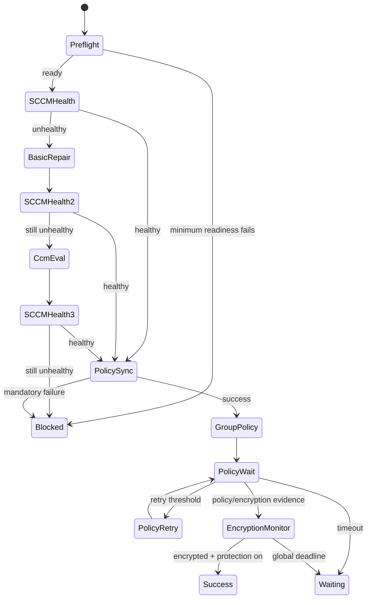

# Architecture

## Design goal

The architecture isolates the technician UI from privileged Windows operations. The UI decides **what workflow should happen**; the PowerShell layer decides **how Windows/SCCM data is read or invoked**; structured results flow back to the worker and UI.

## Components

### `main.py`

Application bootstrap. Creates the Qt application, configures identity/theme behavior, and opens the main window.

### `app/main_window.py`

PySide6 interface and technician interaction layer. It displays readiness, SCCM/BitLocker state, stages, activity, confirmations, diagnostics, and report/export actions.

### `app/worker.py`

The workflow state machine. It is intentionally separate from the UI thread.

Responsibilities include:

- workflow selection
- ordered stage transitions
- timeouts
- retry scheduling
- pause semantics
- cancellation semantics
- SCCM health escalation
- focused vs adaptive SCCM refresh selection
- policy evidence monitoring
- BitLocker status monitoring
- runtime state persistence

### `app/powershell.py`

Creates the Windows PowerShell process boundary and converts the JSON returned by the operations script into Python models.

### `scripts/blade_operations.ps1`

Privileged Windows integration layer. It contains the concrete CIM/WMI, ConfigMgr, service, TPM, network, power, cache, log and BitLocker-status operations.

Every operation returns a structured object with fields equivalent to:

```json
{
  "success": true,
  "status": "ok",
  "message": "...",
  "data": {},
  "errorCode": null
}
```

This keeps parsing logic deterministic and avoids relying on human-formatted console output.

### `app/audit.py`

Evidence/report support for technician traceability.

### `app/constants.py` and `config.json`

Configuration and path boundaries. Runtime state/log paths are kept under ProgramData instead of the source directory.

## Workflow architecture



## Why PowerShell remains part of the design

The project could theoretically replace parts of PowerShell with direct Python Win32/CIM bindings, but PowerShell 5.1 is already present on the supported Windows estate and provides a native administrative interface for:

- CIM/WMI
- Windows services
- TPM
- BitLocker status
- ConfigMgr client namespaces
- Group Policy

Keeping these operations in one PowerShell file also makes the enterprise-specific layer easier to audit than scattering privileged system calls throughout the UI.

## Concurrency and safety

Long-running operations execute in `WorkflowWorker`, a `QThread`. Pause requests prevent a **new** operation from starting; they do not attempt to suspend a Windows operation mid-call. Cancellation similarly waits for the current safe operation boundary before ending the workflow.

This is a deliberate reliability choice: force-killing ConfigMgr or policy operations in the middle of execution would create more uncertainty than it removes.
